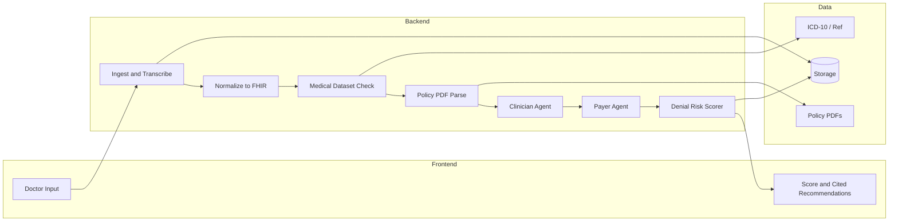

# Healthcare Claim Shield – Plan (Business Flow & Domain)

Shared plan for the team: business flow, USP, pipeline, and **domain-level requirements** (what the system must do and what data/tools it relies on). **Tech stack and timeline are not fixed** — the team can choose frameworks, language, and phasing.

---

## USP: What Makes This Win

**Tagline:** _"See the denial before the payer does."_

**One-liner for judges:** A dual-agent system where a **Clinician Agent** and a **Payer Agent** pre-adjudicate every claim and produce a **Denial Risk Score** (0–100) plus **policy-cited fixes**—so providers fix documentation and coverage gaps before submission, not after rejection.

**Why it stands out:**

| Judging lever          | How the USP addresses it                                                                                                                                                                                                                       |
| ---------------------- | ---------------------------------------------------------------------------------------------------------------------------------------------------------------------------------------------------------------------------------------------- |
| **Innovation (35%)**   | Two specialized agents "debating" (clinician defends documentation, payer evaluates against policy) is visually and conceptually distinctive. Denial Risk Score is a single, memorable metric. Optional: real-time guardrails while dictating. |
| **Technical (25%)**    | Multi-agent orchestration, structured outputs (FHIR), policy chunking + citation, and audio→text→structured pipeline show depth.                                                                                                               |
| **Impact (20%)**       | "Pre-adjudication" and "denial risk" are language revenue and compliance teams already use. The score is actionable and shareable. Policy citations make it auditable and trustworthy.                                                         |
| **Presentation (10%)** | Demo flow is clear: paste/record note → upload policy → watch two agents reason → see score + cited recommendations. One number (the score) and one quote ("Policy 4.2.1 requires…") stick in judges' minds.                                   |

**Differentiators vs "generic" solutions:**

- **Dual-agent pre-adjudication** — Not just "valid/invalid," but a structured **agreement vs disagreement** view (e.g. "Clinician: procedure documented. Payer: policy requires prior auth for this code."). Resolvable before submit.
- **Denial Risk Score (0–100)** — Single metric with explanation (e.g. "Missing laterality," "Prior auth not documented"). Fixes can be ranked by impact on the score.
- **Policy-cited recommendations** — Every warning/suggestion references a **specific policy section or clause** (e.g. "Section 4.2.1: Prior authorization required for CPT 99213 when…"). Builds trust and auditability.
- **Audio in the loop** — Doctor dictates → transcript → same pipeline. Optional: "live" suggestions while dictating (stretch) to position as a documentation co-pilot, not only a firewall.

**Pitch hook for the demo:** "Today, denials happen after you submit. We run the same logic the payer will run—with two AI agents playing clinician and payer—and give you a denial risk score and exact policy citations so you fix it before the claim ever leaves your system."

**Scope extension: claim vs top US payers**

- On the **results page**, optionally show how the same claim would fare against **major US payers** (e.g. UnitedHealthcare, Aetna, Cigna, Humana, Anthem/Elevance) in addition to the user’s uploaded policy.
- This is **extra context**, not a replacement for the primary “check against my policy” result. Implementation can use reference payer rules or policy patterns; see FRONTEND_SPEC.md § 4.6 for UI placement and hierarchy.

---

## Selling the multi-payer comparison to judges

**Objection:** "Patients already have one insurance—why would providers care how the claim stands against UHC, Aetna, etc.?"

**How to sell it:**

1. **Multi-payer practices** — Many providers bill **multiple payers** (Medicare, Medicaid, several commercial plans). The same claim may be submitted to two or three payers. Knowing “this claim scores 72 with your uploaded policy but would score 45 with UHC and 68 with Aetna” helps staff **prioritize** which payer to submit to first, or where to expect the most pushback and add documentation.
2. **Contracting and negotiation** — Revenue cycle and **contracting teams** use denial and acceptance patterns by payer to renegotiate contracts or target process improvements. “Your documentation would pass UHC more often than Aetna for this procedure type” is **actionable intelligence** for contract and operational discussions.
3. **Benchmarking and transparency** — “Your claim is in good shape for your current payer; here’s how it would fare with other major payers” positions the product as giving **broader market context**, not just pass/fail for one policy. It supports selling to larger groups and health systems that care about cross-payer performance.
4. **Secondary insurance and workers’ comp** — In cases with **secondary coverage** or workers’ comp, the same documentation may be evaluated by more than one payer. Showing how the claim stacks up across payers helps staff know where to add or tighten documentation before submission.
5. **Demo and differentiation** — Even when the primary value is “check against my payer,” showing “and here’s how you’d fare with UHC, Aetna, Cigna” makes the product feel **more comprehensive and data-driven** and gives judges a clear, memorable differentiator.

**One-liner for judges:** “We give you a denial risk score for your payer—and show how the same claim would stand with UnitedHealthcare, Aetna, and other major payers, so multi-payer practices and contracting teams can prioritize and improve.”

---

## High-level flow (what the system does)

---

## Pipeline (business steps, order matters)

1. **Ingest** – Accept **text** and/or **audio**. If audio, use **Whisper** (or equivalent) to produce a transcript; use that as the doctor note.
2. **Normalize** – Turn the note into structured clinical data. Output must be **FHIR R4–style** (e.g. JSON: conditions, procedures, diagnoses with codes). Use an LLM with structured output (e.g. JSON mode / function calling) to extract codes and entities.
3. **Medical check** – Cross-reference the extracted codes/terms against a **medical reference dataset**: **ICD-10** (required) and optionally **CPT**. Flag missing, invalid, or unsupported codes.
4. **Policy load** – User provides a **policy PDF**. Use **PDF parsing** (e.g. pdf-parse, PyPDF2, or equivalent) to extract text. Optionally chunk for long documents before sending to the LLM.
5. **Clinician Agent** – Given the FHIR-like claim and any validation issues, output a short "clinician view": what is documented, what might be missing. Structured output (e.g. JSON).
6. **Payer Agent** – Given **policy text**, FHIR claim, and clinician view, output: coverage verdict, **policy-cited** gaps (each with section/clause reference), and suggested fixes. Structured output.
7. **Denial Risk Scorer** – From the Payer Agent output, produce a **0–100 Denial Risk Score** and a short explanation (e.g. "72 — Prior auth and laterality missing; Policy 4.2.1, 3.1."). Can be rule-based or a small LLM step.
8. **Response** – Return to the user: FHIR snippet, clinician summary, payer summary, **Denial Risk Score**, and **policy-cited recommendations** (each with section reference).

Team chooses how to implement the pipeline (e.g. sequential services, workflow engine, or agent framework).

---

## Domain requirements (what must be in the solution)

These are **fixed** for the problem; stack is up to the team.

| Requirement                                | Purpose                                                                                                                                                                                               |
| ------------------------------------------ | ----------------------------------------------------------------------------------------------------------------------------------------------------------------------------------------------------- |
| **Whisper** (or equivalent speech-to-text) | Turn doctor **audio/dictation** into text so it can be normalized to FHIR and checked.                                                                                                                |
| **PDF parse**                              | Extract text from **insurance policy PDFs** so the Payer Agent can reason over policy language and cite sections.                                                                                     |
| **FHIR R4 (JSON)**                         | Standard format for the **normalized claim** (conditions, procedures, diagnoses with codes). Use a small subset (e.g. Observation, Condition, Procedure) as needed.                                   |
| **ICD-10**                                 | **Medical reference dataset** for validating diagnosis codes and (optionally) mapping free text to codes. Must be available locally or via a defined source. See DATA_SOURCES.md for where to get it. |
| **CPT** (optional)                         | Procedure/service codes; improves validation and policy alignment (e.g. "prior auth for CPT 99xxx"). Can be a small curated list or an API.                                                           |
| **Dual agents**                            | **Clinician Agent** and **Payer Agent** as distinct steps with structured outputs; plus a **Denial Risk Scorer** that produces 0–100 and explanation.                                                 |
| **Policy citations**                       | Every recommendation or gap from the Payer Agent must reference a **specific policy section or clause** (e.g. "Section 4.2.1").                                                                       |

---

## Data the system needs

- **ICD-10** – Required. Use a single year (e.g. 2025); either a subset (e.g. 300–500 codes) or full list. See DATA_SOURCES.md for sources (e.g. CDC, GitHub ICD-10-CSV).
- **CPT** – Optional. Small curated list or external API (e.g. NLM HCPCS) is enough.
- **Policy PDFs** – Supplied by the user at runtime; no bundled dataset.
- **Doctor notes** – Supplied by the user (text or audio); no bundled dataset.

No patient data or historical claims are required.

---

## User flow (what the UI must support)

1. **Input:** User provides (a) doctor note (text and/or audio) and (b) optional policy PDF.
2. **Action:** User triggers a single "Run compliance check" (or equivalent).
3. **Results:** Show (a) **Denial Risk Score** (0–100) with short explanation, (b) claim summary (FHIR-like), (c) clinician view and payer view, (d) **policy-cited recommendations**, (e) any validation issues (e.g. invalid ICD-10), (f) **optional extension:** how the same claim stands against **top US healthcare payers** (e.g. UnitedHealthcare, Aetna, Cigna, Humana)—as extra informational context on the results page.

See FRONTEND_SPEC.md for more detailed UI behavior if needed.

---

## Value for the org and clients

- **Org:** Offer this to healthcare clients as a product or add-on (e.g. "Compliance Shield"). Integration options: API for existing systems, or embeddable UI for client portals.
- **Clients (providers):** Fewer denials, less rework, policy-cited feedback before submission. Fits into existing revenue-cycle workflow (e.g. "check before submit").

---

## References in this repo

- **DATA_SOURCES.md** – Where to get ICD-10 (and optionally CPT); what data to keep locally.
- **Details.txt** – Hackathon track description and judging criteria.
